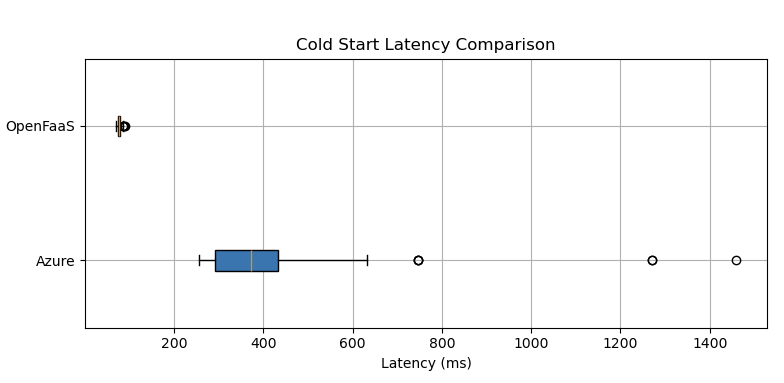
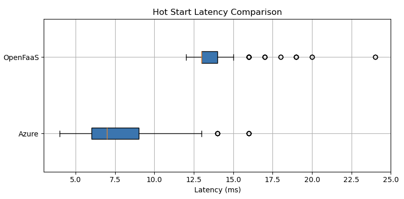
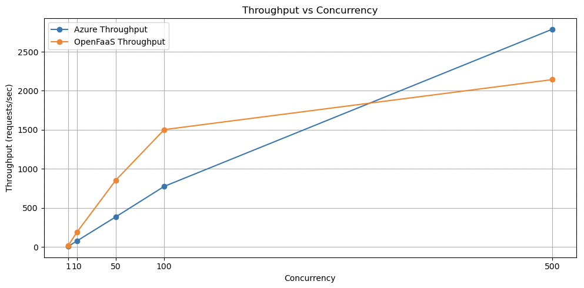
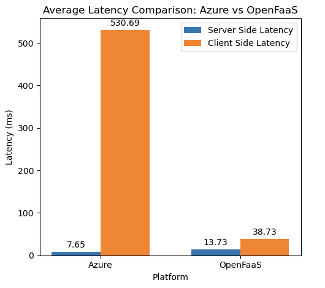

## Table of Contents

- [Description](#description)
- [Experiment Design](#experiement-design)
  - [Experimental Design and Implementation - Commercial](#experimental-design-and-implementation---commercial)
    - [Experimental plan and technology selection](#experimental-plan-and-technology-selection)
    - [Cold start latency test](#cold-start-latency-test)
    - [Hot start latency test](#hot-start-latency-test)
    - [User-side latency test](#user-side-latency-test)
    - [Concurrency and throughput test](#concurrency-and-throughput-test)
  - [Experimental Design and Implementation – OpenSource (OpenFaaS)](#experimental-design-and-implementation--opensource-openfaas)
    - [Experimental plan and technology selection](#experimental-plan-and-technology-selection-1)
    - [Cold start latency test](#cold-start-latency-test-1)
    - [Hot start latency test](#hot-start-latency-test-1)
    - [User-side latency test](#user-side-latency-test-1)
    - [Concurrency and throughput test](#concurrency-and-throughput-test-1)
  - [Results and evaluation](#results-and-evaluation)
- [Project Content](#project-content)


# Description
1) Commercial serverless platform:  Azure Function

2) Open source serverless platform: OpenFaaS

3) Programming language runtime: Java

4) Application description (description of function or workflow of functions): This coursework implements two serverless applications. The first is an empty function, designed to evaluate the cold start performance of serverless platforms. The second is a Fibonacci function, which computes the 30th Fibonacci number and returns the result. The Fibonacci function is employed to assess hot start performance and to conduct stress testing.

# Experiemnt Design
## Experimental Design and Implementation - Commercial

In this experiment, the commercial platform Azure Functions was selected as the experimental platform. The specific experimental design is as follows:

### Experimental plan and technology selection

The experiment first built an environment on the Azure Functions platform (Consumption Plan), and wrote and deployed two Java functions through IntelliJ IDEA:
• Empty Function: no specific business logic, used to measure cold start latency.
• Fibonacci Function: used to calculate the 30th Fibonacci number to simulate the real computing load.

Both functions are implemented in Java and called through HTTP. The execution latency data of cold start and hot start functions are collected through the monitoring log (Azure Monitoring) of the Azure platform.

### Cold start latency test

Use a Python script to call the Empty Function deployed on the Azure platform once every hour, execute a total of 100 calls and record latency data. The one-hour interval was chosen because, according to previous research by Manner et al. (2018), cloud platforms usually shut down function containers after about 20 minutes of idle time. However, the preliminary test showed that the Azure Functions container did not shut down after 20 minutes, so the cooldown period was extended to one hour to ensure that each call was in a cold start state.

### Hot start latency test

To measure the hot start latency, a Python script was used to make an HTTP request to the Fibonacci Function once per second, and 300 calls were made continuously. Before the formal test began, the function was manually called once to ensure that the function was in a hot start state during the test to avoid cold start interference.

### User-side latency test

Considering the actual latency experienced by users, a MacBook M3 laptop with 16GB of memory and 512GB of storage was used to call the Fibonacci Function deployed on Azure once per second through a Python script, 300 calls were made, and the client-perceived latency was recorded. The function was also manually called once before the test to avoid cold starts.

### Concurrency and throughput test

Finally, the Apache JMeter tool was used to simulate performance under different concurrency scenarios. Specifically, setting 1, 10, 50, 100, and 500 concurrent threads to stress test the Fibonacci Function. Each concurrency level test lasted five minutes, and the average latency and throughput performance of function calls in each concurrency scenario were recorded to evaluate the actual performance of Azure Functions under high workload conditions.

## Experimental Design and Implementation – OpenSource (OpenFaaS)

In this experiment, the opensource platform OpenFaaS was selected as the experimental platform. The specific experimental design is as follows:

### Experimental plan and technology selection

A virtual machine (VM) with 2 CPUs and 4GB of memory was created on the Azure cloud platform, and the faasd service was built on the VM. Next, two Java functions were written and deployed:
EmptyFunction: no specific business logic, only used to measure cold start latency.
Fibonacci Function: used to calculate the 30th Fibonacci number to simulate the real computing load.

### Cold start latency test

Since the function container deployed by faasd starts running immediately after deployment, it is difficult to directly test the cold start latency. Therefore, to simulate the real-world cold start scenario, this experiment follows the process below and serves as a control test for the cold start behavior of Azure Functions:

A Shell script is used to delete the function container first and then redeploy it to ensure that the function starts from a cold state. After waiting for 20 seconds, an HTTP request is sent to invoke the EmptyFunction. The entire process is repeated 100 times, and the latency is recorded.The test script is executed inside an Azure virtual machine to eliminate network latency interference in the test results.

### Hot start latency test

To measure the hot start latency, a Python script was used to make an HTTP request to the Fibonacci Function once per second, and 300 calls were made continuously. Before the formal test began, the function was manually called once to ensure that the function was in a hot start state during the test to avoid cold start interference. The script will be executed in an Azure VM to avoid network latency.

### User-side latency test

Considering the actual latency experienced by users, a MacBook M3 laptop with 16GB of memory and 512GB of storage was used to call the Fibonacci Function deployed on Azure once per second through a Python script, 300 calls were made, and the client-perceived latency was recorded. The function was also manually called once before the test to avoid cold starts.

### Concurrency and throughput test

Finally, the Apache JMeter tool was used to simulate performance under different concurrency scenarios. Specifically, setting 1, 10, 50, 100, and 500 concurrent threads to stress test the Fibonacci Function. Each concurrency level test lasted five minutes, and the average latency and throughput performance of function calls in each concurrency scenario were recorded to evaluate the actual performance of Azure Functions under high load conditions.

# Results and evaluation

The experimental results align well with previous research findings by Manner et al. (2018) and Dowd (2020), where cold-start latencies for JVM-based languages like Java were identified as considerably high, reflecting Azure Functions' higher cold-start latency. The latencies difference of Azure Functions between server-side and client-side confirms earlier findings in the literature that user-side latency can significantly exceed internally measured latency due to network overheads and client processing.

OpenFaaS demonstrates a advantage in cold-start latency due to the faasd service maintaining persistent container availability, aligning with its official documentation on optimized initialization procedures. However, as the concurrencies (workload) increases, this advantage gradually decreases, which is consistent with Liu et al. (2023)'s findings about resource constraints affecting latency under high workload.





Azure Functions' excellent throughput at high concurrency indicates that it has stronger scalability, which is also mentioned in the official Azure documentation. OpenFaaS's lower latency and higher throughput at low concurrency levels indicate that it is suitable for latency-sensitive applications with medium usage, while Azure Functions is more beneficial for applications that need scalability under high workload.






# Project Content

README.md: Project introduction
faas-test: Specific implementation of azure function and openfaas function, using IntelliJ IDEA to build the project and Gradle to manage dependencies
script: Python and shell scripts used for testing
test_result: Scripts for generating result graphs

```
├── README.md
├── faas-test
│   ├── azure-function
│   ├── openfaas-emptyfunc
│   └── openfaas-fibonacci
├── script
│   ├── execute_test.sh
│   ├── openfaas_cold_start_test.sh
│   ├── send_http_hundred_request.py
│   ├── send_single_request.py
│   └── test_azurefunc_cold_start.py
└── test_result
    ├── azurefunc_cold_start_data.csv
    ├── azurefunc_hot_start_data.csv
    ├── azurefunc_hot_start_send_from_laptop.csv
    ├── openfaas_cold_start_data.csv
    ├── openfaas_hot_start_data.csv
    ├── openfaas_hot_start_send_from_laptop.csv
    ├── concurrent_performance_test.csv
    ├── barchart_plot.py
    ├── boxplot.py
    ├── concurrent_performance_comparison_plot.py
    ├── cold_start_latency_comparison.jpg
    ├── hot_start_latency_comparison.jpg
    ├── latency_concurrency_comparison.jpg
    ├── server_client_side_latency_comparison.jpg
    └── throughput_concurrency_comparison.jpg
```
